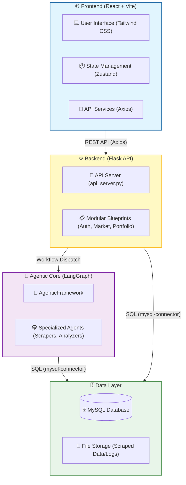
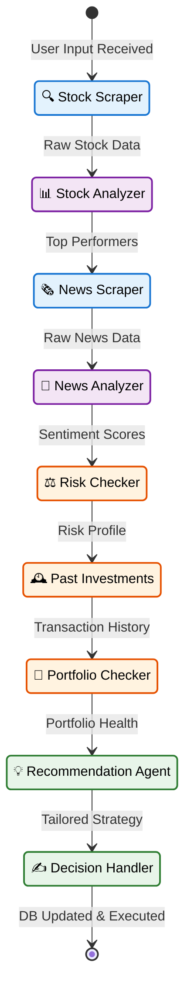

# 🐂 BullBearPK: AI-Driven Agentic Investment Advisor

[](https://opensource.org/licenses/MIT)
[](https://www.python.org/)
[](https://react.dev/)
[](https://flask.palletsprojects.com/)
[](https://www.langchain.com/langgraph)
[]()

**BullBearPK** is a sophisticated, full-stack investment analysis platform designed specifically for the **Pakistan Stock Exchange (PSX)**. By leveraging a multi-agentic AI framework built on LangGraph and CrewAI, it provides retail investors with institutional-grade technical analysis, sentiment tracking, and personalized portfolio recommendations.

---

## 🚀 **Key Value Proposition**

In the volatile world of emerging markets, individual investors often lack the tools to process vast amounts of financial data and news. **BullBearPK** solves this by:
- **Automating Data Intake**: Real-time scraping of PSX and global financial news.
- **Agentic Intelligence**: 9 specialized AI agents working in a coordinated workflow to provide holistic insights.
- **Personalized Risk Mitigation**: Dynamic risk profiling that adapts to your investment history and financial goals.
- **Execution Ready**: Direct translation of AI insights into executable portfolio strategies.

---

## 🛠️ **Tech Stack**

### **Frontend**
- **Framework**: React 18 with Vite (TypeScript)
- **State Management**: Zustand
- **Visualization**: Recharts & Framer Motion
- **Styling**: Tailwind CSS & Lucide Icons

### **Backend & API**
- **Core**: Python (Flask)
- **Database**: MySQL (optimized for financial time-series and user records)
- **Connectivity**: RESTful API with modular Blueprints

### **AI & Agentic Layer**
- **Orchestration**: LangGraph (State Machine)
- **Agent Framework**: CrewAI
- **LLMs**: OpenAI (GPT-4), Groq (for fast inference)
- **Scraping**: Selenium & BeautifulSoup4
- **NLP**: TextBlob (Sentiment Analysis)

---

## 🧠 **System Intelligence**

### **High-Level Architecture**
The system is built on a 4-tier modular architecture ensuring scalability and decoupled concerns.



### **Agentic Workflow (LangGraph State Machine)**
Our specialized agents execute a deterministic yet flexible graph-based workflow.



---

## 🕵️ **Meet the Agents**

| Agent | Expertise | Capability |
| :--- | :--- | :--- |
| **Input Taker** | User Interface | Validates inputs and prepares session state |
| **Stock Scraper** | Data Acquisition | Real-time extraction of PSX market data via Selenium |
| **Stock Analyzer** | Technical Analysis | Computes 60+ indicators (RSI, MACD, Bollinger Bands) |
| **News Scraper** | OSINT Extraction | Aggregates financial news from RSS and Web sources |
| **News Analyzer** | Sentiment Engine | Quantifies market sentiment and identifies key events |
| **Risk Checker** | Risk Management | Behavioral assessment and quantitative risk scoring |
| **Past Investments**| History Analysis | Pattern recognition in user portfolio history |
| **Portfolio Checker**| Portfolio Health | Real-time P&L tracking and diversification analysis |
| **Recommendation** | AI Strategist | Synthesizes all data into personalized stock picks |
| **Manager Record** | Transactional | Executes decisions and maintains database integrity |

---

## 🗄️ **Data Schema Details**

| Table | Component | Primary Data |
| :--- | :--- | :--- |
| `users` | Identity | Goal-driven risk tolerance profiling |
| `stocks` | Market Data | Core financial attributes of PSX-listed companies |
| `stock_analysis`| Indicators | Extensive technical dataset for quantitative analysis |
| `news_analysis` | NLP Insights | Sentiment scores and identified risk factors |
| `portfolios` | Asset Mgmt | Historical snapshots of user holdings and valuation |

---

## 🏁 **Getting Started**

### **1. Prerequisites**
- **Python**: 3.8 or higher
- **Node.js**: 16.0 or higher
- **MySQL**: 8.0 or higher

### **2. Setup & Installation**

**Backend Installation:**
```bash
# Clone the repository
git clone https://github.com/yourusername/bullbearpk.git
cd bullbearpk

# Install backend dependencies
pip install -r requirements.txt
```

**Database Initialization:**
1. Create a MySQL database named `bullbearpk`.
2. Update the credentials in `database_config.py`.
3. Import the schema:
```bash
mysql -u [username] -p bullbearpk < backend/database/mysql_schema.sql
```

**Frontend Installation:**
```bash
cd frontend
npm install
```

### **3. Running the Platform**

**Launch Backend:**
```bash
cd backend
python api_server.py
```

**Launch Frontend:**
```bash
cd frontend
npm run dev
```

---

## 🤝 **Contributing**

BullBearPK is a professional-grade platform aimed at modernizing investment strategies for the Pakistani market. Contributions are welcome! Please open an issue or submit a pull request for any enhancements.

---

## 📄 **License**

This project is licensed under the MIT License - see the [LICENSE](LICENSE) file for details.

---

<p align="center">
  Developed with ❤️ for the Pakistani Financial Community.
</p>

---

## 📄 **License**

This project is proprietary software for BullBearPK investment platform. 